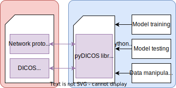

# pyDICOS

[](https://opensource.org/licenses/MIT)
[](https://github.com/Auxilia-tech/pyDICOS/actions/workflows/publish-pypi-deploy.yml)
[](https://github.com/Auxilia-tech/pyDICOS/actions/workflows/tests.yml)
[](https://codecov.io/gh/Auxilia-tech/pyDICOS)

## Motivations

This project was initiated to enable the usage of DICOS data in machine learning workflows. 
PyDICOS is intended to be a simple python wrapper of Stratovan's C++ [DICOS library](https://www.stratovan.com/products/dicos-toolkit).
Note that this is **NOT** an open source implementation of the DICOS standard.

PyDICOS relies on [pybind11](https://github.com/pybind/pybind11) to wrap DICOS user-level API to python.
It depends on numpy to load data in python and can easily be installed _via_ `pip`.

PyDICOS is unrelated to [pydicom](https://github.com/pydicom/pydicom) in its implementation and contributors, 
while being similar in its core spirit (enabling python data manipulations).

## Open Architecture

We firmly believe that by releasing this library, we will encourage and support the [Open Architecture framework](https://www.aci-europe.org/downloads/resources/TSA-230504-7_4.1%20Attachment%201%20OA%20for%20Airport%20Security%20Systems%202nd%20Edition%20%20FINAL.pdf). We welcome all actors of airport security to review and use this library.

## Scope

 - Provide a pythonized API for the DICOS toolkit
   - [x] First release : read/write functions for CT, DX and TDR, user-level API
   - [x] First releases : DICOS protocol, client/server functions
   - [ ] Future release : more pure python functions to shave off heavy cpp signatures 
   - [ ] Future release : library indexed in Pypi 
   - [ ] Out of scope for now : Windows release
   - [ ] Out of scope for now : AIT2D, AIT3D, QR
   - [ ] Out of scope for now : Module and Tag level APIs
 - Stay up to date with Stratovan latest releases
   - Currently tested and supported DICOS version : `v3`

## Install

### Building from source

To setup the build environment, clone the repository, create your virtual environment and install required dependencies

```bash
git clone https://github.com/Auxilia-tech/pyDICOS
cd pyDICOS
python3 -m venv venv
source venv/bin/activate
pip install -r requirements.txt
```

Install the [Stratovan toolkit](https://www.stratovan.com/products/dicos-toolkit) in the `opt` folder. If the library is already installed in another folder, skip this step and change the SDICOS path variable in `setup.sh`.
```bash
chmod +x ./sdicos_lin_ubuntu-20-{version}.run
./sdicos_lin_ubuntu-20-{version}.run --unattendedmodeui none --mode unattended --prefix /opt/stratovan/sdicos
chmod 755 -R /opt/stratovan/sdicos
```

To generate a python wheel :

```bash
chmod +x setup.sh
./setup.sh
```

The lib wheel should be produced in the `dist` folder and can be installed _via_ `pip` in any local virtual environment.

### 🚧 Using Pypi index 🚧

🚧 This install method has not been released yet. 🚧

Using [pip](https://pip.pypa.io/en/stable/) directly from Pypi index :
```bash
pip install pydicos
```

## Usage

### Concept diagram

<div align="center">

</div>

### Script usage

Refer to our [exemple files](https://github.com/Auxilia-tech/pyDICOS/tests) to explore the binded methods.
The stratovan exemple files were entirely translated in python.

Here is a quick exemple for a script that reads a CT and a DX scan.

```python
from pydicos import dcsread, dcswrite

ct = dcsread("SimpleCT/SimpleCT.dcs")
data = ct.get_data() # list of 3-dimentionnal numpy arrays
dcswrite(ct, "SimpleCT/SimpleCT_2.dcs")

dx = dcsread("DXFiles/SimpleDX.dcs")
data = dx.get_data() # 2-dimentionnal numpy array
dcswrite(dx, "DXFiles/SimpleDX_2.dcs")

tdr = dcsread("SimpleTDR/SimpleTDR.dcs")
data = tdr.get_data() # dictionnay of metadata
dcswrite(tdr, "SimpleTDR/SimpleTDR_2.dcs")
```

More complex operations can be addressed by using the C++ functions directly. 
They can be invoked using the `pyDICOS` modules. For example, the previous 
script would look like this :

```python
from pyDICOS import CT, DX, TDR, ErrorLog, Filename
   
ct, err, file = CT(), ErrorLog(), Filename("SimpleCT/SimpleCT.dcs")
if not ct.Read(file, err, None):
   raise RuntimeError(f"Failed to read DICOS file: {file.Get()}\n{err.GetErrorLog().Get()}")
data = ... # This is very long, refer to pydicos._loaders::CTLoader.get_data for full script
if not ct.Write(Filename("SimpleCT/SimpleCT_2.dcs"), err):
   raise RuntimeError(f"Failed to write DICOS file: SimpleCT/SimpleCT_2.dcs\n{err.GetErrorLog().Get()}")

dx, err, file = DX(), ErrorLog(), Filename("SimpleDX/SimpleDX.dcs")
if not dx.Read(file, err, None):
   raise RuntimeError(f"Failed to read DICOS file: {file.Get()}\n{err.GetErrorLog().Get()}")
data = np.array(dx.GetXRayData().GetUnsigned16(), copy=False)
if not dx.Write(Filename("SimpleDX/SimpleDX_2.dcs"), err):
   raise RuntimeError(f"Failed to write DICOS file: SimpleDX/SimpleDX_2.dcs\n{err.GetErrorLog().Get()}")

tdr, err, file = TDR(), ErrorLog(), Filename("SimpleTDR/SimpleTDR.dcs")
if not tdr.Read(file, err, None):
   raise RuntimeError(f"Failed to read DICOS file: {filename}\n{err.GetErrorLog().Get()}")
data = ... # This is very long, refer to pydicos._loaders::TDRLoader.get_data for full script
if not tdr.Write(Filename("SimpleTDR/SimpleTDR_2.dcs"), err):
   raise RuntimeError(f"Failed to write DICOS file: SimpleTDR/SimpleTDR_2.dcs\n{err.GetErrorLog().Get()}")
```
As you can see, `pyDICOS` is the direct translation of the C++ classes and in-place methods signatures. The objects of the `pydicos` library inherit the methods available in `pyDICOS`. More details in (architecture)[pydicos/architecture.md]

### Testing

The library can be tested via `pytest`
```bash
pytest tests/
```

## Contributing

As our resources are limited, we very much value your contributions, be it bug fixes, new core features, or documentation improvements.
For more information, please read our [contribution guide](CONTRIBUTING.md).

### Contributors acknowledgement

Many thanks to our main contributors :

 - [Ahmad Audi](https://github.com/AAUDI) is a freelance developper specialized in C++ and python. He is available for similar work on [upwork](https://www.upwork.com/freelancers/~01a066bd29ed6d1a64). [LinkedIn](https://www.linkedin.com/in/ahmadaudi/)
 - [Louis Combaldieu](https://github.com/lcombaldieu) is the cofounder and CTO of Auxilia. He specializes in deep learning and computer vision. Get in touch with him through our [contact form](https://www.auxilia-tech.com/contact) to learn more about pyDICOS and Auxilia's line of products.

## License

This software is released under the [MIT license](https://opensource.org/licenses/MIT).

### Stratovan inherited disclaimer

    ##############################################################################
    ### Stratovan Corporation Copyright and Disclaimer Notice:
    ###
    ### Copyright (c) 2014 Stratovan Corporation. All Rights Reserved.
    ###
    ### Permission to use, copy, modify, and distribute this software and its
    ### documentation without a signed licensing agreement, is hereby granted,
    ### provided that this copyright notice, this paragraph and the following two
    ### paragraphs appear in all copies, modifications, and distributions.
    ###
    ### IN NO EVENT SHALL STRATOVAN BE LIABLE TO ANY PARTY FOR DIRECT, INDIRECT,
    ### SPECIAL, INCIDENTAL, OR CONSEQUENTIAL DAMAGES, INCLUDING LOST PROFITS,
    ### ARISING OUT OF THE USE OF THIS SOFTWARE AND ITS DOCUMENTATION, EVEN IF
    ### STRATOVAN HAS BEEN ADVISED OF THE POSSIBILITY OF SUCH DAMAGE.
    ###
    ### STRATOVAN SPECIFICALLY DISCLAIMS ANY WARRANTIES, INCLUDING, BUT NOT LIMITED
    ### TO, THE IMPLIED WARRANTIES OF USE AND FITNESS FOR A PARTICULAR PURPOSE. THE
    ### SOFTWARE AND ACCOMPANYING DOCUMENTATION, IF ANY, PROVIDED HEREUNDER IS
    ### PROVIDED "AS IS". STRATOVAN HAS NO OBLIGATION TO PROVIDE MAINTENANCE,
    ### SUPPORT, UPDATES, ENHANCEMENTS, OR MODIFICATIONS UNLESS DIRECTED BY THE
    ### U.S. GOVERNMENT'S TRANSPORTATION SECURITY ADMINISTRATION (TSA).
    ###
    ##############################################################################