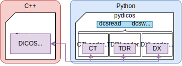

# Architecture

`pydicos` objects inherit their methods directly from `DICOS`

## DICOS methods

### CT

ct.ADD_SLICE_FAILURE_POLICY           ct.GetScanStartTime                   ct.SetFrameOfReferenceUID
ct.AddSection                         ct.GetScanType                        ct.SetImageAcquisitionDateAndTime
ct.Begin                              ct.GetSectionByIndex                  ct.SetImageAcquisitionDuration
ct.End                                ct.GetSeriesAcquisitionStatus         ct.SetImageType
ct.FreeMemory                         ct.GetSeriesDate                      ct.SetInstanceNumber
ct.GenerateScanInstanceUID            ct.GetSeriesInstanceUID               ct.SetMachineAddress
ct.GenerateSeriesInstanceUID          ct.GetSeriesTime                      ct.SetMachineID
ct.GenerateSopInstanceUID             ct.GetSopClassUID                     ct.SetMachineLocation
ct.GetContentDate                     ct.GetSopInstanceUID                  ct.SetNumberOfSections
ct.GetContentTime                     ct.HasBurnedInAnnotation              ct.SetOOIID
ct.GetFrameOfReferenceUID             ct.IMAGE_FLAVOR                       ct.SetOOIIDAssigningAuthority
ct.GetImageAcquisitionDate            ct.Initialize                         ct.SetOOIIDType
ct.GetImageAcquisitionDuration        ct.IsCDI                              ct.SetOOIType
ct.GetImageAcquisitionTime            ct.IsSDI                              ct.SetPhotometricInterpretation
ct.GetImageFlavor                     ct.IsStandard                         ct.SetSDI
ct.GetImageType                       ct.OBJECT_OF_INSPECTION_TYPE          ct.SetScanDescription
ct.GetInstanceNumber                  ct.OOI_IMAGE_CHARACTERISTICS          ct.SetScanID
ct.GetModality                        ct.PHOTOMETRIC_INTERPRETATION         ct.SetScanInstanceUID
ct.GetNumberOfFilesToCreate           ct.Read                               ct.SetScanStartDateAndTime
ct.GetNumberOfSections                ct.SCAN_TYPE                          ct.SetScanType
ct.GetOOIID                           ct.SendOverNetwork                    ct.SetSeriesAcquisitionStatus
ct.GetOOIIDAssigningAuthority         ct.SetBurnedInAnnotation              ct.SetSeriesDateAndTime
ct.GetOOIIDType                       ct.SetCDI                             ct.SetSeriesInstanceUID
ct.GetOOIImageCharacteristics         ct.SetContentDateAndTime              ct.SetSopInstanceCreationDateAndTime
ct.GetOOIType                         ct.SetDeviceCalibrationDateAndTime    ct.SetStandard
ct.GetPhotometricInterpretation       ct.SetDeviceManufacturer              ct.TRANSFER_SYNTAX
ct.GetScanID                          ct.SetDeviceManufacturerModelName     ct.VOLUME_MEMORY_POLICY
ct.GetScanInstanceUID                 ct.SetDeviceSerialNumber              ct.Write
ct.GetScanStartDate                   ct.SetDeviceSoftwareVersion  

### DX

dx.GetBlueLUT                          dx.Initialize                          dx.SetLUTData
dx.GetGreenLUT                         dx.PIXEL_DATA_CHARACTERISTICS          dx.SetPresentationLUTShape
dx.GetLUTData                          dx.PRESENTATION_INTENT_TYPE            dx.SetWindowCenterAndWidth
dx.GetModality                         dx.PRESENTATION_LUT_SHAPE              dx.SetWindowCenterAndWidthExplanation
dx.GetPresentationLUTShape             dx.Read                                dx.SetXRayTubeCurrent
dx.GetRedLUT                           dx.SetImageOrientation                 dx.Validate
dx.GetWindowCenterAndWidth             dx.SetImagePosition                    dx.Write
dx.GetXRayData                         dx.SetKVP 

### TDR

tdr.ABILITY_ASSESSMENT                        tdr.GetPTOAssessmentProbability               tdr.SetFrameOfReferenceUID
tdr.ABORT_FLAG                                tdr.GetPTOIds                                 tdr.SetImageScaleRepresentation
tdr.ABORT_REASON                              tdr.GetPTOProcessingTime                      tdr.SetInstanceNumber
tdr.ADDITIONAL_INSPECTION_SELECTION_CRITERIA  tdr.GetScanInstanceUID                        tdr.SetMachineAddress
tdr.ALARM_DECISION                            tdr.GetScanStartDate                          tdr.SetMachineID
tdr.ASSESSMENT_FLAG                           tdr.GetScanStartTime                          tdr.SetMachineLocation
tdr.AddPTOAssessment                          tdr.GetScanType                               tdr.SetOOIID
tdr.AddPotentialThreatObject                  tdr.GetSeriesAcquisitionStatus                tdr.SetOOIIDAssigningAuthority
tdr.AddReferencedInstance                     tdr.GetSeriesDate                             tdr.SetOOIIDType
tdr.AddReferencedSopInstance                  tdr.GetSeriesInstanceUID                      tdr.SetOOIType
tdr.GenerateSopInstanceUID                    tdr.GetSeriesTime                             tdr.SetOperatorTDR
tdr.GetATRInfo                                tdr.GetSopInstanceUID                         tdr.SetPTOProcessingTime
tdr.GetAbortFlag                              tdr.GetTDRType                                tdr.SetProcessingEndTime
tdr.GetAbortReason                            tdr.GetThreatBoundingPolygon                  tdr.SetProcessingStartTime
tdr.GetAdditionalInspectionCriteria           tdr.GetThreatRegionOfInterest                 tdr.SetScanID
tdr.GetAlarmDecision                          tdr.GetTotalProcessingTimeInMS                tdr.SetScanInstanceUID
tdr.GetAlarmDecisionDateTime                  tdr.Initialize                                tdr.SetScanStartDateAndTime
tdr.GetBaggagePTODetails                      tdr.OBJECT_OF_INSPECTION_GENDER               tdr.SetScanType
tdr.GetContentDate                            tdr.OBJECT_OF_INSPECTION_ID_TYPE              tdr.SetSeriesAcquisitionStatus
tdr.GetContentTime                            tdr.Read                                      tdr.SetSeriesDateAndTime
tdr.GetFrameOfReferenceUID                    tdr.SetAbortFlag                              tdr.SetSeriesInstanceUID
tdr.GetImageScaleRepresentation               tdr.SetAdditionalInspectionCriteria           tdr.SetSopInstanceCreationDateAndTime
tdr.GetInstanceNumber                         tdr.SetAlarmDecision                          tdr.SetTDRType
tdr.GetModality                               tdr.SetAlarmDecisionDateTime                  tdr.SetTDRTypeATR
tdr.GetNumAlarmObjects                        tdr.SetBaggagePTODetails                      tdr.SetThreatBoundingPolygon
tdr.GetNumPTOs                                tdr.SetBaggagePTOLocationDescription          tdr.SetThreatRegionOfInterest
tdr.GetNumberOfObjects                        tdr.SetContentDateAndTime                     tdr.SetTotalProcessingTimeInMS
tdr.GetOOIID                                  tdr.SetDeviceCalibrationDateAndTime           tdr.TDR_TYPE
tdr.GetOOIIDAssigningAuthority                tdr.SetDeviceManufacturer                     tdr.THREAT_CATEGORY
tdr.GetOOIIDType                              tdr.SetDeviceManufacturerModelName            tdr.ThreatType
tdr.GetOperatorTDR                            tdr.SetDeviceSerialNumber                     tdr.Write
tdr.GetPTOAssessmentDescription               tdr.SetDeviceSoftwareVersion     

## Pure-python functions

- dcsread
- dcswrite